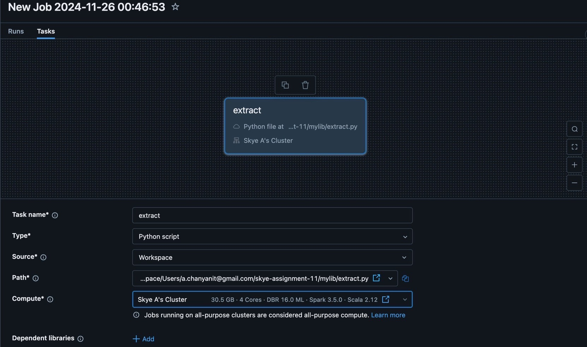
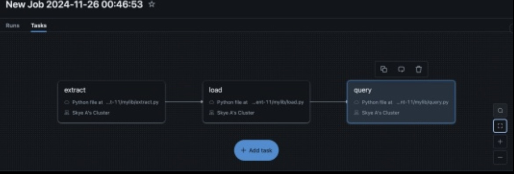
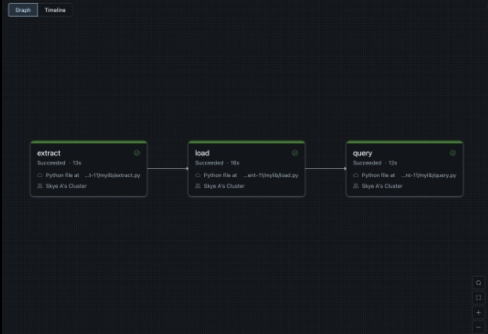

[](https://github.com/nogibjj/skye-assignment-11/actions/workflows/cicd.yaml)

# Skye Assignment 11 - Databricks Data Pipeline

This project demonstrates an **ETL data pipeline** built with **Databricks** using PySpark. The pipeline includes three main steps:
1. **Extract**: Download a dataset from a public URL and save it to Databricks FileStore (DBFS).
2. **Load & Transform**: Load the dataset into a PySpark DataFrame, perform transformations, and save the processed data back to DBFS.
3. **Query**: Perform SQL-based queries on the transformed data and save query results as a CSV file.

## Requirements
- Create a data pipeline using Databricks.
- Include at least one data source and one data sink.

## Pipeline Workflow
### 1. Extract
- **Source**: [Chess Transfers Dataset](https://github.com/fivethirtyeight/data/blob/master/chess-transfers/transfers.csv)
- Downloaded and saved to DBFS at: 
```plaintext
dbfs:/FileStore/skye-assignment-11/transfer.csv
```

### 2. Transform and Load
- **Transformations**
   - Renamed columns.
   - Filled missing values in the `former_fed` column.
- **Task**: Transformed data saved at:
```plaintext
dbfs:/FileStore/skye-assignment-11/transformed_transfer.csv
```

### 3. Query
- **Query**: Count the number of transfers by `federation`.
- **Task**: Query results saved as:
```plaintext
dbfs:/FileStore/skye-assignment-11/transfer_summary.csv
```

## File Structure
```plaintext
skye-assignment-11/
├── mylib/
│   ├── extract.py         # Data extraction logic
│   ├── load.py            # Data loading and transformation logic
│   ├── query.py           # SQL query logic
├── main.py                # Orchestrates the pipeline
├── requirements.txt       # Python dependencies
├── .github/
│   └── workflows/
│       └── cicd.yml       # CI/CD pipeline for validation
└── README.md              # Documentation
```

## Setting Up the Pipeline in Databricks

### **1. Clone the Repository into Databricks**
1. Navigate to **Workspaces** > **Users** in Databricks.
2. Click your email ID to open your workspace.
3. Select **Create** > **Git Folder**.
4. Paste the repository URL: https://github.com/nogibjj/skye-assignment-11.git.

### **2. Set Up a Compute Cluster**
1. Go to the **Compute** section in Databricks.
2. Click **Create** and choose **Personal Compute**.
3. Configure the cluster with the following settings:
- **Runtime**: `16.0 ML (Apache Spark 3.5.0, Scala 2.12)`
- **Node Type**: `i3.xlarge` (or an appropriate type for your task).
- **Terminate After**: `4320 minutes` of inactivity.
4. Attach the cluster to your workspace.

### **3. Install Required Libraries**
1. Navigate to **Compute** > **Libraries** and click **Install New**.
2. Choose **PyPI** as the library source.
3. Install the following libraries:
- `pandas`
- `pytest`
- `python-dotenv`
- `requests`
4. Confirm installation and ensure the libraries are available for the cluster.

### **4. Create ETL Pipeline Jobs**
1. Navigate to the **Workflows** section and click **Create Job**.
2. Add tasks for each step of the pipeline as follows:



#### **Task 1 - Extract**
- Name: `extract`
- Type: `Python Script`
- Source: `Workspace`
- Script Path: `mylib/extract.py`
- Cluster: Your configured compute cluster.

#### **Task 2 - Load**
- Name: `Load`
- Type: `Python Script`
- Source: `Workspace`
- Script Path: `mylib/load.py`
- **Depends On**: `Extract`

#### **Task 3 - Query**
- Name: `Query`
- Type: `Python Script`
- Source: `Workspace`
- Script Path: `mylib/query.py`
- **Depends On**: `Load`



### **6. Run the Pipeline**
1. Navigate to **Workflows** and select your job.
2. Click **Run Now** to execute the pipeline.
3. Monitor task execution:
- The pipeline will run in sequential order: `Extract` > `Load` > `Query`.



4. Verify the output files in **DBFS**:
- Extracted Data: 
```plaintext
dbfs:/FileStore/skye-assignment-11/transfer.csv
```
- Transformed Data: 
```plaintext
dbfs:/FileStore/skye-assignment-11/transformed_transfer.csv
```
- Query Results: 
```plaintext
dbfs:/FileStore/skye-assignment-11/transfer_summary.csv
```

## Deliverables
1. Databricks Notebook or Script: Provided in the mylib/ folder.
2. Pipeline Outputs: Extracted data, transformed data, and query results saved in DBFS.
3. CI/CD: GitHub Actions workflow (.github/workflows/cicd.yml) for pipeline validation.
